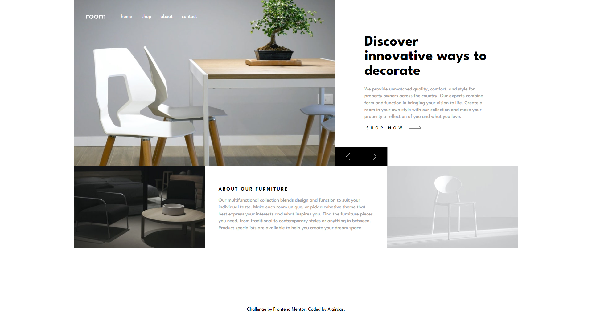
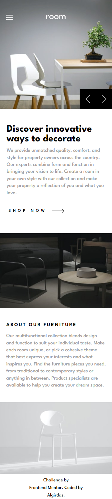
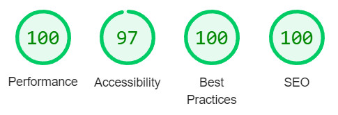

# Frontend Mentor - Room homepage solution

This is a solution to the [Room homepage challenge on Frontend Mentor](https://www.frontendmentor.io/challenges/room-homepage-BtdBY_ENq). Frontend Mentor challenges help you improve your coding skills by building realistic projects. 

## Table of contents

- [Overview](#overview)
  - [The challenge](#the-challenge)
  - [Screenshot](#screenshot)
  - [Links](#links)
- [My process](#my-process)
  - [Built with](#built-with)
  - [What I learned](#what-i-learned)
  - [Useful resources](#useful-resources)
- [Author](#author)
- [Acknowledgments](#acknowledgments)

## Overview

### The challenge

Users should be able to:

- View the optimal layout for the site depending on their device's screen size
- See hover states for all interactive elements on the page
- Navigate the slider using either their mouse/trackpad or keyboard

### Screenshot


 


### Links

- Solution URL: (https://github.com/AlgirdasU/Room-homepage-master)
- Live Site URL: (https://beautiful-vacherin-cc2dc1.netlify.app/)

## My process

### Built with

- Semantic HTML5 markup
- CSS custom properties
- Flexbox
- CSS Grid
- BEM
- JS

### What I learned

I've learned how to make the image/text slide to the left or right using screen buttons or right and left arrow keys on keyboard. I found how to make responsive size of text or space with simple function (clapm()), without media queries. The function takes three parameters: a minimum value, a preferred value, and a maximum allowed value. Exemple below.


```html
<h1 class="heading-primary">Text</h1>
```
```css
.heading-primary {
  font-size: clamp(4rem, 3.5vw, 4.5rem);
}
```

### Useful resources

 (https://www.udemy.com/course/the-complete-javascript-course/) - This course helped me how to write JS code for slides.
 (https://www.udemy.com/course/advanced-css-and-sass/) - How to write CSS grid etc.

## Author


- Website - [Algirdas](https://github.com/AlgirdasU/Room-homepage-master)
- Frontend Mentor - [@Algirdase](https://www.frontendmentor.io/profile/AlgirdasU)
- Twitter - [@AlgirdasDdd](https://twitter.com/algirdasddd)

- Website - [Algirdas](https://github.com/AlgirdasU/Room-homepage-master)
- Frontend Mentor - [@Algirdase](https://www.frontendmentor.io/profile/AlgirdasU)
- Twitter - [@AlgirdasDdd](https://twitter.com/algirdasddd)

## Acknowledgments
Jonas Schmedtmann courses helped me write this code. Thanks.
